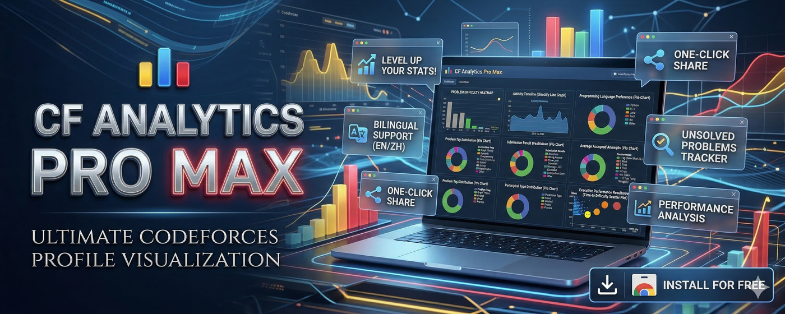
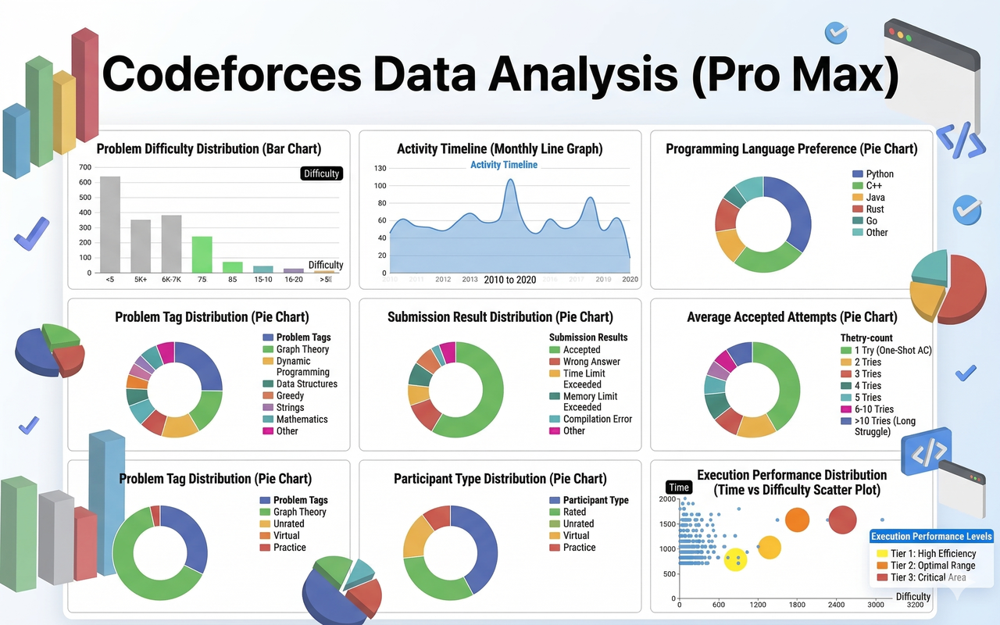

# Codeforces Analytics (Pro Max) 📊

[](LICENSE)
[](manifest.json)
[](#installation--development)

An intuitive, powerful Chrome extension that enriches Codeforces profile pages with multi-dimensional data visualizations, problem-solving analytics, and one-click high-resolution image export.



---

## 📢 Project Status: Archived & Unmaintained

> [!IMPORTANT]
> **Notice to the Community & Potential Maintainers:**
> - **No Active Maintenance**: The original creator has stepped down from Codeforces and has stopped maintaining this project.
> - **No PRs Reviewed or Merged**: Due to zero bandwidth, **no pull requests or code submissions will be reviewed, audited, or merged** into this repository. This repository is kept as an archive of the original codebase.
> - **Forks Welcome**: You are encouraged to **fork** this repository under the MIT License and maintain your own version independently. If you publish your own version or extension, please credit the original repository and extension as per the license.

---

## ✨ Features

- **Comprehensive Visual Analytics**:
  - Solved problems by Rating distribution
  - Problem tags breakdown & distribution
  - Verdict statistics (AC, WA, TLE, etc.)
  - Submission language distribution
  - Problem index breakdown (A, B, C, D...)
  - Unsolved problems tracker
- **High-Resolution Export**: Export complete, beautifully rendered analytics cards into a long image with one click (powered by `html2canvas`).
- **Interactive Charts**: Responsive and modern chart interactions powered by `Apache ECharts`.
- **Bilingual Localization**: Native support for both English (`en`) and Simplified Chinese (`zh_CN`).
- **Zero Configuration**: Built with pure vanilla JavaScript and Chrome Manifest V3 — no complicated node build steps required.

---

## 📸 Preview



---

## 🚀 Installation & Local Development

No Node.js or build steps required. You can load and run the extension directly:

1. **Clone this repository**:
   ```bash
   git clone https://github.com/<your-username>/codeforces-analytics-extension.git
   cd codeforces-analytics-extension
   ```

2. **Open Chrome Extension Management**:
   Navigate to `chrome://extensions` (or `edge://extensions` on Microsoft Edge).

3. **Enable Developer Mode**:
   Toggle on the **Developer mode** switch in the top right corner.

4. **Load the Extension**:
   - Click **"Load unpacked"** (加载已解压的扩展程序).
   - Select the `codeforces-analytics-extension` root folder.

5. **Test it on Codeforces**:
   Visit any user profile on Codeforces (e.g., `https://codeforces.com/profile/tourist` or your own handle) to see the charts automatically loaded!

---

## 📁 Project Structure

```text
codeforces-analytics-extension/
├── manifest.json         # Chrome Extension Manifest V3 configuration
├── content.js            # Main content script (fetches API data & renders ECharts)
├── popup.html            # Extension popup UI
├── popup.js              # Popup localization script
├── _locales/             # Internationalization (i18n)
│   ├── en/messages.json  # English strings
│   └── zh_CN/messages.json# Chinese strings
├── icons/                # Extension icons (16px, 48px, 128px)
├── lib/                  # Vendor libraries (echarts.min.js, html2canvas.min.js)
├── assets/               # Screenshots and promotional banners
├── privacy-policy.md     # Extension privacy policy
├── LICENSE               # MIT License
└── README.md             # Project documentation
```

---

## 🤝 Contributing & Forking

Contributions are what make the open-source community such an amazing place to learn, inspire, and create. Any contributions you make are **greatly appreciated**.

1. Fork the Project
2. Create your Feature Branch (`git checkout -b feature/AmazingFeature`)
3. Commit your Changes (`git commit -m 'Add some AmazingFeature'`)
4. Push to the Branch (`git push origin feature/AmazingFeature`)
5. Open a Pull Request

---

## 📄 License

Distributed under the **MIT License**. See [`LICENSE`](LICENSE) for more information.

---

## 🌟 Acknowledgments

- [Codeforces API](https://codeforces.com/apiHelp) for public submission data
- [Apache ECharts](https://echarts.apache.org/) for chart rendering
- [html2canvas](https://html2canvas.hertzen.com/) for long-picture snapshot export
